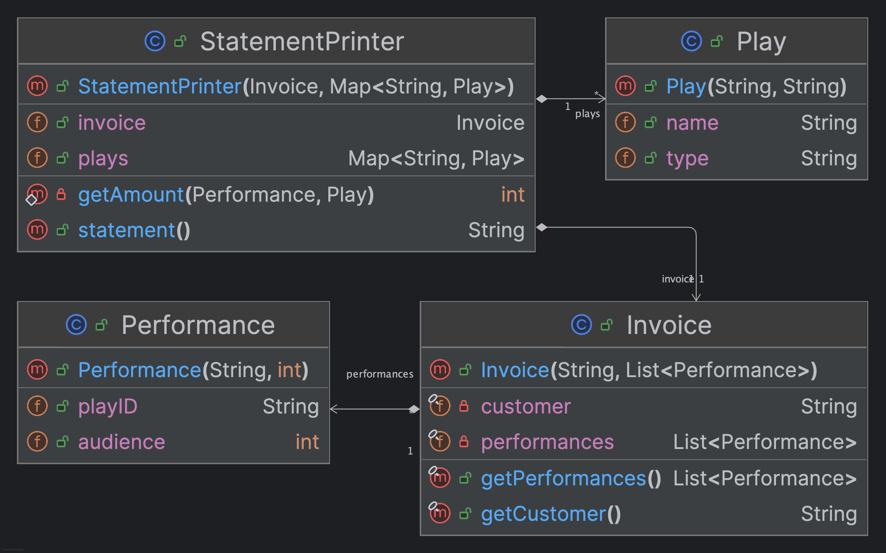
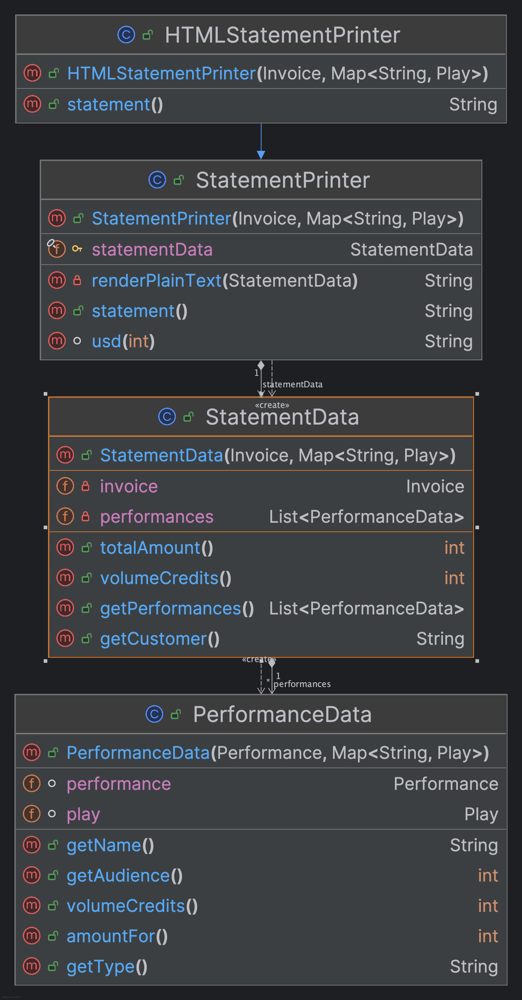
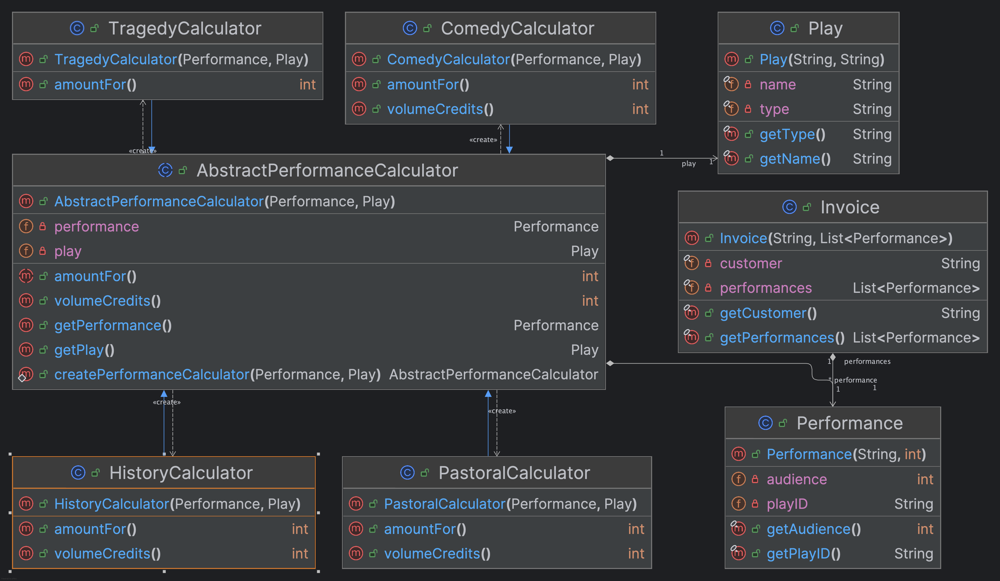
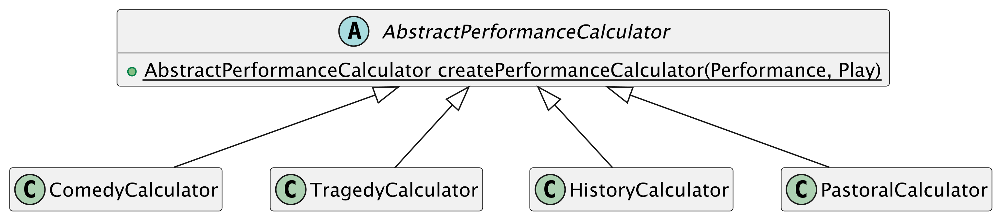

# Refactoring Assignment

_Refactoring_ is when you reorganize your program without changing the outcome: the user of your application
wouldn't notice, unless things are faster or slower. In this assignment, you will refactor a program.

There are three major parts:

1. Fix the style and design errors (mostly automatically using IntelliJ).
2. Refactor the code, following a series of steps that we give you.
3. Implement two new features in the code now that it is easier to do so.

[Martin Fowler](https://martinfowler.com) is an influential professional software engineer who has written
a few books on refactoring, and provides
[a free first chapter](https://www.thoughtworks.com/content/dam/thoughtworks/documents/books/bk_Refactoring2-free-chapter_en.pdf)
demonstrating common refactoring techniques using the Javascript programming language.
In this assignment, you'll follow a refactoring process that closely follows the ideas
and process in this chapter, but using Java.
You will probably find it helpful to refer to the free chapter for inspiration.

## Learning Objectives

By the end of this assignment, you will be able to:

- identify and fix common style and coding issues using the CheckStyle plugin for IntelliJ
- apply common refactoring techniques to clean existing code
- use built-in IntelliJ refactoring to more efficiently apply common refactoring techniques
- add new features to existing code once it has been cleaned
- more confidently work with git

## The Domain

Please refer to the free textbook chapter if you would like additional context about the domain used in this example,
but, briefly, we are working on a program for printing invoices for a theater company. The program currently only supports
specific types of plays and generates a plaintext invoice like below:

```
Statement for BigCo
  Hamlet: $650.00 (55 seats)
  As You Like It: $580.00 (35 seats)
  Othello: $500.00 (40 seats)
Amount owed is $1,730.00
You earned 47 credits
```

This information is derived from the play and performance information contained in the input json files shown below.
The dollar amounts are calculated based on the type of performance and the size of the audience.

`invoices.json`:
```json
[
  {
    "customer": "BigCo",
    "performances": [
      {
        "playID": "hamlet",
        "audience": 55
      },
      {
        "playID": "as-like",
        "audience": 35
      },
      {
        "playID": "othello",
        "audience": 40
      }
    ]
  }
]
```
and `plays.json`:
```json
{
  "hamlet": {"name": "Hamlet", "type": "tragedy"},
  "as-like": {"name": "As You Like It", "type": "comedy"},
  "othello": {"name": "Othello", "type": "tragedy"}
}
```

The starter code currently works for this example, but we are tasked with adding two new features:
- print the invoices in html format instead of plaintext.
- support other types of plays.

For reference, the UML Class Diagram for our starter code looks something like below:



Once we add support for the html output format, our code will look something like below
(omitting irrelevant classes; exact variables and methods may vary):



And once we add support for other play types, our code will look something like below
(omitting irrelevant classes; exact variables and methods may vary):



Our task is to transform our starter code so that it looks like the final code above.
We'll do this through a sequence of refactoring steps, running the tests after each step.

## What is refactoring?

When you refactor, you make a series of changes that improve the design of the software — but without changing the behaviour.
As seen in lecture, there are lots of reasons for this: to make the code easier for other programmers to understand
and navigate (and debug), to make it easier to automatically test, and to make it easier to add new features.

Some refactoring will be style changes: naming, indentation, brace placement, and so on.
 
Some refactoring will involve restructuring your code: adding a parameter to a method,
moving a method from one place to another, reordering code to group related statements, and so on.

**As a rule, when refactoring, the code should always pass the existing tests!**

The assignment is about the process, not the final result. We provide a list of tasks. For each task, here is the process:

1. Do a refactoring
2. Run the tests and fix any bugs you introduced
3. **Make a commit**

**Important: remember to run your tests before each commit to ensure they are still passing with each refactoring!
That way when you introduce a bug you'll notice it right away.**

**Important: as you complete each task (once you see that the tests all pass), make a commit.**

Self tests will be available on MarkUs later to ensure you are following the process; we'll be using your git logs to
check your commits. **Make sure to follow the instructions about what to put in your commit messages as you go.**

# Overview

Here are the tasks you will perform.

- Run the tests to confirm you are ready to start refactoring.
- Address the existing CheckStyle issues.
- Do a series of refactorings to improve the design of the code.
- Add new functionality to the code.
- Do some more refactoring.
- Implement one more feature.
- Address any CheckStyle issues which remain in your code.

## The refactorings

See [refactoring_techniques.md](./refactoring_techniques.md).

IntelliJ can do many of these automatically. Take the time to learn how,
because you'll be using these kinds of shortcuts for the rest of your programming lives. 

## What do I do if I screw something up?

Inevitably, you're going to make a mistake — forget to commit, commit the wrong thing, realize you got something backwards,
did steps in the wrong order. Here are some common problems and solutions.

### Made a mess locally but didn't commit it yet?

If you have made a mess of a local file and want to just start over from the last commit,
use `git checkout thefile.txt`. This discards the local changes.

### Committed something you shouldn't have?

You can check out any commit done to the repository. If you remember where you messed up,
you can revert to the version just before that. To explore your old commits,
use [git log](https://git-scm.com/book/en/v2/Git-Basics-Viewing-the-Commit-History). (That is a clickable link.)

Please read that article until you understand what the `-p` 
 flag does well enough to explain it to your pet.
The `+`, `-`, `+++`, and `---` markers are important.

When you get to the `--stat` flag, you can stop reading.

Notice how important it is to use good commit messages so that you can find the one you want.
Remember the list of refactoring techniques linked above? Those refactoring names might make pretty good commit messages.
They give context to what you were doing at each step.

# Task 0: Run the Tests

Before doing any coding, find the tests and run them.
The project should be configured with an existing run configuration for `StatementPrinterTests`.
If you don't see this listed beside the run button, look in the `test` folder
to find class `StatementPrinterTests`. Right click on it and find `Run …` in the menu.

Tip: once the `StatementPrinterTests` run configuration exists, you should see a
run button in this readme; you can click that to run the tests whenever you are
reminded to do so in these instructions. Neat!

# Task 1: Initial Code Clean Up

Before we get to work adding our new feature, we'll take time to clean up our starter code.
This will make the new feature easier to implement.

Both Bob Martin and SonarSource, the company that develops the SonarLint plugin,
promote a ["Clean as You Code" mindset](https://docs.sonarsource.com/sonarqube/latest/user-guide/clean-as-you-code/):
leave the program cleaner than when you found it and your teammates and future-you will appreciate it.

Here's the [TL;DR](https://www.merriam-webster.com/dictionary/TL%3BDR) for what "Clean as You Code" means:

1. Make sure that all your new code is beautiful.
2. If you have to change old code (add a method to a class or update a method's return type, for example) and
  notice a style or design issue, then fix it. Don't go hunting; just tidy what's in front of you.
3. Write a unit test or two for your changes if one doesn't already cover it. If the old code doesn't have any
   tests yet, this is especially important. (Note: for this assignment, we have provided the required tests for you.)

The parts of the old code that get touched frequently will be clean sooner (saving time each time it is touched).

Doing this kind of old-code refactoring in its own commit is an excellent idea.

## Task 1.1: Code Style

We'll be using `CheckStyle` as one tool to automatically scan our Java projects for style issues.

- [ ] The project includes a file called `mystyle.xml`. The project _should_ already be configured to use it,
  but if not, you can go into the IntelliJ settings, go to `Tools -> CheckStyle` and add `mystyle.xml` as a
  new configuration file. For the description, you can call it anything you want, such as `CSC207 Checks`.

- [ ] For each Java source file in `src/main/java/`, fix all CheckStyle issues that are detected.
  You should either see the CheckStyle Tool Window icon (it looks like a pencil) on the left of IntelliJ or
  you may need to go to `View -> Tool Windows -> CheckStyle` to open the CheckStyle Tool Window. See the
  following which talks more about this step.

**Important: make sure you are using the provided `mystyle.xml` configuration for CheckStyle as outlined above.**
Companies follow many different styles, but every established software company uses a style guide
and automated tools to find style and design violations.

Once you have CheckStyle set up, you'll see red underlines in the code. Hover — don't click — and a popup will
appear mentioning what the problem is and often suggesting a fix.

**After you fix each one, run the test file (`StatementPrinterTests`) to make sure you didn't introduce a bug.**

Here is a list of CheckStyle issues you can expect to encounter in the starter code.

* Public instance variables: the `Encapsulate Field...` feature is useful! You usually only need a getter and not a setter.

* Non-final variables: variables that are only assigned to once should be declared `final`.

* Braces required for if statements and loops: add braces `{}` around the box of the if.

* Javadoc comment is missing: public classes should have Javadoc describing them.
  - Try writing a Javadoc comment yourself. For inspiration, you can look at some provided Javadoc in the starter files;
  IntelliJ can also help with this (https://www.jetbrains.com/help/idea/javadocs.html).
  The details of what exactly you write in your JavaDoc comments won't be graded, but practice writing good comments. As in first year, the documentation should help you understand
  the purpose of the code when you read it _without_ explaining how Java works.

* Magic numbers: these are an issue because there is no context for what the values represent.
  These mostly appear in the `statement` method. **There are constants defined in `Constants.java`.
  Use these instead.**

* Static modifier out of order: always use `public`, `static`, and `final` in that order.

Tips:
- browse through the various starter files for ideas about how to fix each CheckStyle issue,
  as we have already fixed some issues in the files.
- in general, take this time to get more comfortable with the IDE,
  as its features will help you be a more efficient programmer.
- If you don't understand a step, refer to the free textbook chapter by Martin Fowler.
- If you still don't understand a step, please ask for clarification on Piazza and mention the
  task number and which step you are working on.

### **Important: Add, commit, and push your changes.**

- [ ] When you are done, commit your work with a commit message that includes the string "Task 1.1".

**Important: we'll be looking for the string "Task 1.1" in your git log of commit messages!

If you find that you need to make a new commit because you forgot something,
you can use the same commit message, perhaps with a note about the new fix.

## Task 1.2: Git Log
Git includes commands to allow you to conveniently summarize and explore the commit history of your git repository.

As highlighted already, the emphasis in this assignment is on the process of performing the
refactoring. To document this process, you will also maintain a record of your git log in your
repository.

- [ ] Run the command `git log --since 2024-09-30 --oneline` in the terminal and copy+paste the output
  into the `week4git/log.txt` file to replace all of its contents.
  - Alternatively, make sure your terminal is open in your week3git directory and you can run
    `git log --since 2024-09-30 --oneline > log.txt` to replace the contents of the log.txt file with the log output.

**Important**: do this each time you are asked to commit your work in the remaining tasks.

- [ ] Commit your changes to `log.txt` now; include the string "Task 1.2" in your commit message. 

Note: this commit won't include the updated log with the most recent commit, which is fine. The next
time we ask you to commit, you'll update your `log.txt` file again and commit the updated log.

## Task 1 Recap

- There should now be no CheckStyle issues and `StatementPrinterTests` should still pass.

## Refactoring

It's time to refactor: make small-ish changes to your code, progressing incrementally toward a better design.

This follows the steps outlined in the Refactoring textbook (page number reference in [] beside each). See below for a concise list.

1. Create a helper method and move code into it (_Extract Method_) [page 6]
2. Rename a local variable [page 9]
3. Rename a parameter [page 10]
4. Remove a parameter from the helper function (_Replace Temp with Query_, which has several sub steps) [page 10]
    - Create another tiny helper function and call it (IntelliJ: _Extract Method_) [page 12]
    - Remove a local variable (IntelliJ: _Inline Variable_) [page 12]
    - Remove a parameter (IntelliJ: _Change Signature_) [page 12]
5. Remove a local variable (IntelliJ: _Inline Variable_) [page 14]
6. Move a calculation into a method (IntelliJ: _Extract Method_) [page 14]
7. Rename a local variable [page 16]
8. Create a helper method for a calculation (_Replace Temp with Query_) [page 16]
9. Rename a method (IntelliJ: _Change Signature_) [page 17]
10. Separate the accumulation of a few variables (_Split Loop_) [page 18]
11. Move the initializations close to their loops (_Slide Statements_) [page 18]
12. Remove a local variable (_Replace Temp with Query_) [page 19]

Each subtask roughly corresponds to a step described in that textbook, although the example is written in JavaScript there,
so some differences in programming language features lead to differences in how our code will end up looking for us.

**Reminder: upon completing each subtask, make sure to commit your work and update your git log!**

**Reminder: Address CheckStyle issues as they come up to ensure you don't reintroduce any poor coding style as you refactor!
In the final task, you'll be tasked with fixing all remaining issues, so do your best to address them as you
go in order to make the final cleanup as small as possible — future-you will appreciate it!**

## Task 2: Decomposing the `statement` method

This method consists of the main logic of the program. For someone seeing the code for the first time,
it can be easy to get lost in the details. Our first goal is to identify the high-level purpose of each logical chunk of code,
then refactor to make the logic easier to see.

Throughout, we provide links to the IntelliJ documentation when available. **That way you can learn the keystrokes.**

### Task 2.1: Extracting the `switch` statement logic

The `switch` statement exists to calculate the base amount for a given performance and play. Let's make that explicit
by moving it to a helper method.

IntelliJ Documentation: [Extract Method](https://www.jetbrains.com/help/idea/extract-method.html)

1. **Create a helper method and move code into it.**

   Apply `Extract Method` to turn the `switch` statement into its own helper method for calculating the base amount
   for a given performance and play. Name the new method `amountFor`.
   **Tip: select the whole switch statement INCLUDING the declaration for `thisAmount`,
   then IntelliJ's Refactor->Extract Method tool. That declaration is part of the `switch` statement calculation.**

   - do the tests still run (`StatementPrinterTests`)?

2. **Rename a local variable.**
   
   Many programmers like to use `result` as the name for the variable used to hold the return value.
   The code currently uses `thisAmount`. Rename that local variable in your extracted method by right-clicking
   the variable name and choosing `Refactor -> Rename`. Notice that it updates it throughout the method!
   
   - don't forget to fix any CodeStyle or SonarLint issues which may have popped up during this refactor step!
   - note: at this point, your extracted helper method should be a `static` method.
   - do the tests still run?

3. **Rename a parameter.**

   `p` is probably not a great name for a variable of type `Performance`. Rename it to something longer,
   like `performance`. Do this by right-clicking on variable and selecting `Refactor->Rename`.
   This will rename it everywhere it is used so you only have to type it once!

4. **Remove a parameter from the helper function.**

   The extracted method header has two parameters, a `Performance` variable and a `Play` variable.
   The latter is unnecessary: if we have a `Performance` object, we can always look up which `Play` object
   is associated with it using the `plays` instance variable, so it feels unnecessary to pass in both
   a `Performance` object and a `Play` object to our helper.

   We'll apply _Replace Temp with Query_ to stop using the parameter. This happens in 2 steps: _Extract Method_,
   then _Inline Variable_.
   
   1. **Create another tiny helper function and call it.**

      Select the expression on the right-hand side of the initialization for variable `play` in the for loop in
      method `statement`, then use _Extract Method_. `getPlay` is a good name.
   
      - at this point, you should delete the `static` keyword from your helper method, since you will need to
        call the non-static `playFor` method to obtain the relevant `Play` object.

   2. **Remove a local variable.**

      Select that same `play` variable in method `statement` and choose Refactor->Inline Variable. This will replace
      all occurrences of variable `play` in method `statement` with a call on the new tiny helper method, `getPlay`.

   3. **Remove a parameter.**
   
      With the new tiny helper method, we can now remove the `play` parameter from method `amountFor`. This requires 2 steps:
      
      a. Variable `play` is used twice in the method. Replace both of them with a call on the new helper `getPlay`.
 
      b. Now variable `play` is no longer used in the method body for `amountFor`.
         Update your first helper method, along with your call to it, such that it only takes a `Performance` object as a parameter.
         In IntelliJ, use the `Refactor->Change Signature` refactoring and deleting the second parameter.
         Right-click on the method header to open the menu.
   
   - That was big! Make sure the tests still run (`StatementPrinterTests`), and **commit your work**.

5. The last step is to look back at how the result of our call to this helper is actually used in method `statement`.
  It turns out we are storing the value in a local variable for convenience, but the code is arguably easier to understand
  if we again apply the `Inline Variable` refactoring.
6. In IntelliJ, right-click the `thisAmount` variable and choose `Refactor -> Inline Variable`.
7. Run the tests and fix anything that fails!
8. Update your `log.txt` file and commit the changes to any files.
  Make sure to include the string "Task 2.1" in your commit message. 

### Task 2.2: Extracting Volume Credits

_**Did you update your `log.txt` and commit your changes when you completed the previous task?
Do it now before you go any further!**_

Now that we have dealt with getting the base amount for each performance,
we can turn our attention to refactoring the part of the code responsible for calculating the volume credits.

9. **Move a calculation into a method.**

   As before, we will use `Extract Method` to move the logic of calculating the volume credits for a
   performance into a helper method. We will have to fix a few extra things after we do.

   The statements directly following `// add volume credits` (including the `if` statement)
   update the volume credits for the current performance `p`.
   Our helper method will calculate and return the contribution from the current performance.

   Highlight those lines of code related to volume credits then 
   right-click and choose `Refactor -> Extract Method`. Use `volumeCreditsFor` as the method name.

   - note that this will result in an awkward helper which takes in the current value for volume credits,
     possibly increments it, then returns it.
   - also, CheckStyle may complain: "Assignment of parameter 'volumeCredits' is not allowed."
   - to fix this, replace the `int volumeCredits` parameter with a local variable and initialize it to 0.
     This removes the dependency on the `volumeCredits` value from method `statement`,
     because the method now just returns the contribution from the current performance.
   - you will need to update where you call method `volumeCreditsFor` to make sure you're using `volumeCredit += ...`.
     The refactoring step may have replaced that with just an assignment statement `=`.

10. **Rename a local variable.** 
   As before, rename the local variable in your `volumeCreditsFor` helper to be `result`.

11. Run the tests and fix anything that fails!
12. Update your `log.txt` file and commit the changes to any files.
   Make sure to include the string "Task 2.2" in your commit message.

### Task 2.3: Removing the `frmt` Variable

- do the tests still run (`StatementPrinterTests`)?

**Note: this step looks slightly different from how it is done in the textbook,
but the result is the same. Plus, it will demonstrate how helpful IntelliJ can be when refactoring.**

The goal now is to clean up how the `frmt` variable is used in the code.
Initially, it was declared near the top of the method and then used twice later on
to format integers as dollar amounts. As we have seen already, it may make the code
easier to understand if we avoid extra local variables.
Follow the steps below to refactor this part of the code.

13. **Remove a local variable.**

   Apply the `Inline Variable` refactoring to the `frmt` variable.
   
   - this won't immediately look like it accomplished much, but it will now make it convenient for our next step.

14. **Create a helper method for a calculation.**

   Here, we're going to create a method that, given an amount, returns a `String` containing the amount of
   dollars in US currency. We'll move all that `NumberFormat` stuff inside there, too.

   There are two expressions we want to replace with a call on that helper method.
   Select the SECOND call to `NumberFormat.getCurrencyInstance(Locale.US).format` as well as the arguments
   to that call. (The first may not do the correct refactoring.) Perform an `Extract Method` refactoring
   and press Enter once done.

   - when you press Enter, a pop-up window _may_ appear which will prompt you to consider
   changing the signature of your newly extracted helper. Accept this change and take a look
   at what has changed. You'll see that the helper takes an `int` as its parameter now
   and the division by `Constants.PERCENT_FACTOR` is performed within the helper. This is precisely
   what the textbook arrives at, but it takes a bit more manual work.

   - You may need to manually move some code around to get the result above.
     Remember to run the tests (`StatementPrinterTests`) frequently so mistakes are caught while they are easy to undo!

   - `getFormat` does not convey the meaning of the method. It's about US dollars, so rename it to `usd`.

   - As a sanity check, our two method calls at this point are `usd(amountFor(p))` and `usd(totalAmount)`.
   Yours should look similar.

   - make sure to check the parameter name for your helper and update it to ensure that it is descriptive.

15. Update your `log.txt` file and commit the changes to any files.
    Make sure to include the string "Task 2.3" in your commit message.

### Task 2.4: Removing Total Volume Credits and Total Amount

Currently, the accumulation of volume credits is in the same loop as we are calculating
the total amount and also the `result` return value. This is preventing us from extracting
a natural method for calculating the total volume credits, so we need to break it up.

First, we will decouple the logic into three loops, then we will refactor using the same techniques as before.

16. **Separate the accumulation of a few variables.**
    
    Apply the _Split Loop_ refactoring to split out the logic of volume credits,
    the logic of the total amount, and the accumulation of the `result` string into
    three independent loops. An easy way is to copy the `for` loop header and paste
    it twice, then type the closing `}` brace for each.

17. **Move the initializations close to their loops.**

   Apply the `Slide Statements` refactoring to slide the declaration and initialization
   of each accumulator variable to just above its associated loop.
   In IntelliJ, Option-Shift-UpArrow (Ctrl-Alt-Shift-UpArrow on Windows) and
   Option-Shift-DownArrow (Ctrl-Alt-Shift-DownArrow on Windows) will move the current
   line up or down so you don't have to copy and paste.
   - Note: this step is necessary so that IntelliJ can do some automatic refactoring for us.

18. **Remove a local variable.**

   We'll again perform a `Replace Temp with Query` refactoring which amounts to first applying
   `Extract Method` and then `Inline Variable` to refactor the calculation of volume credits.

   - select the loop for volume credits, including the `int volumeCredits` declaration
   and apply `Extract Method`. Once that's done, right click on `volumeCredits` and apply
   `Inline Variable`.
   - use the convention of accumulating into a `result` variable.
   - Refactor the `totalAmount` loop as well, following the same steps.

19. Update your `log.txt` file and commit the changes to any files.
    Make sure to include the string "Task 2.4" in your commit message.

**Note, don't do this for the `StringBuilder` result part, as we'll do something else
to refactor that part next.**

## Intermission Blurb

At this point, we have done a substantial refactoring and can admire our progress so far!
Our `statement` method is now just a handful of lines of code which are solely responsible for forming
the string to be returned. All the actual computation is offloaded to our helper methods!
The code is much easier to understand at a glance, with the details of the computation
easy to dig into if the reader needs to do so.

For those interested, you can read more in the free textbook chapter, as the author says more
about what we have accomplished so far with our refactoring.

## Task 3: Splitting the Phases of Calculation and Formatting

Recall that one of our goals is to implement the new feature of HTML output. With this in mind,
our next step is to further split out the steps of **i)** calculating the data we want to display and
**ii)** actually displaying the data using the specific format we want. Once this division is clear in our code,
it will be much easier to add our HTML output feature without copying and pasting large chunks of code.

### Task 3.1: Split Phase

As the name suggests, our goal is to split the code into distinct phases (i and ii from above).

1. Apply `Extract Method` on the code which corresponds to (ii), which is precisely the entire body
   of our `statement` method! Call the extracted method `renderPlainText` as they do in the textbook.
   - This may seem to not accomplish anything at all, but it will make sense in a few more refactoring steps. 

2. In Split Phase, we will create an object whose responsibility it is to transfer data between the two phases.
   We'll introduce this object now and incrementally build up its variables and methods.
   - Add the line `StatementData statementData = new StatementData();` as the first line of the body of your `statement` method.
   - Hover over `StatementData` and choose the option to create a new class called `StatementData`.
   - Update the call to `renderPlainText` to take in `statementData`.
   - Update the method signature for `renderPlainText` to be consistent; IntelliJ will help with this.

In the following steps, our goal is now to extract any code that isn't strictly about rendering the invoice
out of `renderPlainText` and into our `StatementData` class. Starting from the top of the method,
the first bit of code will be `getInvoice().getCustomer()`.

3. Refactor so that you can replace `getInvoice().getCustomer()` with `statementData.getCustomer()`.

4. Refactor so that you can replace `getInvoice().getPerformances()` with `statementData.getPerformances()`.
   - Hint: after you have done this, you should be able to delete the `StatementPrinter.getInvoice` method.
   - Make sure the tests (`StatementPrinterTests`) still pass.

For our next step, we'll try to address the issue that `renderPlainText` is currently doing computations
involving each `Performance` object from our instance of `Invoice`. Our goal in the next steps is to
move all of these calculations into our constructor for `StatementData`. The `StatementData` class will
then need to provide a public method to access the list of computed results so that `renderPlainText` can still
work as before.

* * *

Tip: it can be helpful to have multiple files open at once for some refactorings — or for reading these
instructions as you are working. Right-clicking the tab for a file at the top of IntelliJ will give you options
to "Split and Move Right". Give it a try if you haven't used this editor feature before.

* * *

5. Edit the loop in `renderPlainText` to use `for (PerformanceData performanceData : statementData.getPerformances())`.
   - Have IntelliJ create this new class `PerformanceData` for you, then add an instance variable in `StatementData` of type
     `List<PerformanceData>` and modify method signatures as needed.
   - Since we have replaced the loop variable with a new type, you'll notice a number of things now break in the loop body;
     fix them now by doing the following:
   - Add a `getAudience` method to the `PerformanceData` class.
   - Add a `getType` method to the `PerformanceData` class. Use this in place of statements
     like `getPlay(p).getType()` in `renderPlainText`
     Hint: you'll need to pass the plays into your `StatementData` constructor to make this work.
   - Add an `amountFor` method to the `PerformanceData` class. Use this in place of statements
     like `amountFor(p)` in `renderPlainText`.
     Hint: you'll need to move the logic of the `amountFor` method into your `PerformanceData` class. You
     can copy+paste the method over and remove its parameter; adjusting the body to address any errors. There
     should only be a couple places you need to fix. After this is done, you can delete the `amountFor` method
     entirely from the `StatementPrinter` class!
   - Hint: don't forget to populate your list of `PerformanceData` objects in the constructor for `StatementData`!

The above step required a lot of refactoring since introducing the `PerformanceData` class causes a lot
of parts of the code in `StatementPrinter` to need to move.

**Make sure the tests (`StatementPrinterTests`) still pass.**

At this point, all that is left is moving over the calculations of `totalAmount` and `volumeCredits`.

6. Create a method called `totalAmount` in the `StatementData` class and implement it based on the existing
   logic from `renderPlainText`. The `renderPlainText` method should then call this new `totalAmount` method.

7. Create a method called `volumeCredits` in the `StatementData` class and implement it based on the existing
   logic from `renderPlainText`. The `renderPlainText` method should then call this new `volumeCredits` method.

**Make sure the tests (`StatementPrinterTests`) still pass.**

Now, the logic has been completely moved out of the `StatementPrinter` class and into the `StatementData` class!
One last step.

8. We no longer need our private instance variables for the plays and invoice, so make the `StatementData` object
   we were using an instance variable called `statementData` and move the
   `StatementData statementData = new StatementData(invoice, plays);` line up into the constructor.

**Make sure the tests (`StatementPrinterTests`) still pass.**

9. Update your `log.txt` file and commit the changes to any files.
    Make sure to include the string "Task 3.1" in your commit message.

## Task 3.2: HTML Output

With the Split Phase complete, we can go ahead and finally add our first new feature: HTML output!

10. Uncomment the test in `HTMLPrinterTests.java`.

11. Subclass the `StatementPrinter` class with a new class called `HTMLStatementPrinter`. Override
   the `statement` method such that the sample test in `HTMLPrinterTests.java` passes. You can refer to
   page 31 of the textbook for roughly what the code will look like; we have also put a Java copy below.
   Note that you may need to adjust things slightly depending on what you named things, but your code
   should be similar.
   - Hint: to help debug, we recommend that you set a breakpoint in the test case at the point
     where the expected and actual are both defined so that you can conveniently compare them
     character by character. These tests will also be available on MarkUs to double check in case
     there are any issues with newline differences between MacOS and Windows.

```java
public String statement() {
        final StringBuilder result = new StringBuilder(String.format("<h1>Statement for %s</h1>%n",
                statementData.getCustomer()));
        result.append("<table>").append(System.lineSeparator());
        result.append(String.format(" <caption>Statement for %s</caption>%n", statementData.getCustomer()));
        result.append(" <tr><th>play</th><th>seats</th><th>cost</th></tr>").append(System.lineSeparator());
        for (PerformanceData perfData : statementData.getPerformances()) {
            // print line for this order
            result.append(String.format(" <tr><td>%s</td><td>%s</td><td>%s</td></tr>%n",
                    perfData.getName(),
                    perfData.getAudience(),
                    usd(perfData.amountFor())));
        }
        result.append("</table>").append(System.lineSeparator());

        result.append(String.format("<p>Amount owed is <em>%s</em></p>%n", usd(statementData.totalAmount())));
        result.append(String.format("<p>You earned <em>%s</em> credits</p>%n", statementData.volumeCredits()));
        return result.toString();
    }
```


12. Update your `log.txt` file and commit the changes to any files.
   Make sure to include the string "Task 3.2" in your commit message.

## Task 4: Reorganizing the Calculations by Type

That is one new feature implemented, but what about handling other play types? We observe that right now we
use a conditional to calculate quantities based on the play type. If we want to add another play type, we
need to add to our switch statement. This doesn't sound very open-closed now does it!

Intuitively, we should be able to introduce polymorphism to replace this conditional structure.

The following describes how we can start going about accomplishing this.

### Task 4.1: Creating a Performance Calculator

We start by creating an inheritance hierarchy and applying the `Replace Constructor with Factory Method` refactoring.

Our desired structure will look something like below (only the factory method is shown; variables and other methods omitted):



1. In a new Java file, create a class called `AbstractPerformanceCalculator` with two instance variables, a performance and a play.
2. Have IntelliJ generate a constructor for you which takes in and sets the performance and the play by right-clicking
   inside the class and choosing `Generate... -> Constructor`.

In our `StatementData` class, before we create a `PerformanceData` object,
we will delegate calculations to our new `AbstractPerformanceCalculator` class.
To do this, we will need to create an instance of this class. However, we don't want to _directly_ create this object,
as we will want to allow for an appropriate subclass of `AbstractPerformanceCalculator` to later be used based on which kind
of play we are dealing with — we'll get to that a bit later.
For now, we will create a "factory function" which will simply return a new `AbstractPerformanceCalculator` object.
"Function" refers to the fact that it will be a static method, so a class method.

3. In `AbstractPerformanceCalculator`, create a new static method called `createPerformanceCalculator`
   which has the same parameters as this class constructor and simply returns a new instance of `AbstractPerformanceCalculator` for now.

4. Use `Extract Method` to create a private helper for the snippet of code which creates a new `PerformanceData` object
   in the `StatementData` constructor. Call this helper `createPerformanceData`.

5. Inside this private helper, use the new static `AbstractPerformanceCalculator.createPerformanceCalculator`
   method to create a local variable referencing a new `AbstractPerformanceCalculator` object.
  - Note: this object won't do anything yet; the next steps will move the calculation of the amount
    and volume credits out of the `PerformanceData` class and into our `AbstractPerformanceCalculator` class.

**Fundamentally, we are going through a sequence of steps to move around lines
of code to make it easier to identify the responsibility of each part of the code.**

**Make sure the tests (`StatementPrinterTests`) still pass.**

6. Update your `log.txt` file and commit the changes to any files.
   Make sure to include the string "Task 4.1" in your commit message.


### Task 4.2: Moving Functionality into the `AbstractPerformanceCalculator`

As we have already noted, we now want to delegate all work related to calculating
the amount and volume credits for a specific performance to our new `AbstractPerformanceCalculator` class.
To do so, we will identify which variables and methods we want to move
from our `PerformanceData` class to our `AbstractPerformanceCalculator` class.

7. Apply the `Move Method` refactoring twice to move the two methods responsible for calculating the amount
   and volume credits from our `PerformanceData` class into our `AbstractPerformanceCalculator` class.
   **Importantly, don't get rid of the original methods just yet (so copy+paste code but don't actually remove
   the original methods)! More on this in the next step.**
   - depending on the names of things, you may need to update the variable names in these methods once they
     are in their new class.

8. Now that the `AbstractPerformanceCalculator` has the logic for calculating the amount and volume credits, we can remove
   that logic from the `PerformanceData` class entirely.
   - Change the signature of the `PerformanceData` constructor such
     that it also takes in the amount and volume credits as parameters which our `AbstractPerformanceCalculator` can now calculate
     for us.
   - Add instance variables to store the amount and volume credits; change the signatures of the methods for getting the
     amount and volume credits in `PerformanceData` to align with the `getVolumeCredits` and `getAmount` conventions for
     getter methods. Make sure all calls to these methods are updated.
   - make sure to run the tests (`StatementPrinterTests`) at this point to ensure the code is still functionally correct!

9. Update your `log.txt` file and commit the changes to any files.
    Make sure to include the string "Task 4.2" in your commit message.

### Task 4.3 Making the Performance Calculator Polymorphic

Our final step is to incorporate subclasses of the `AbstractPerformanceCalculator` to handle the differences
between tragedies and comedies. Currently, the differences are realized as conditional statements in our code.
Instead, we will override these methods and pull out the conditional logic into the corresponding subclasses.

10. In two new Java files, create empty subclasses of `AbstractPerformanceCalculator` called `TragedyCalculator`
   and `ComedyCalculator`.
   - when you make each extend its parent class, IntelliJ will flag that you haven't defined a constructor yet,
     so you can have it automatically do this for you.

13. For the method calculating the amount, determine which logic should remain in the super version of the method
   and which logic should be implemented in the subclass.
   - hint: the behaviour is unique to each subclass

14. If you didn't in the previous step, make this method abstract in the `AbstractPerformanceCalculator` class and
   make `AbstractPerformanceCalculator` an abstract class.

15. Since `AbstractPerformanceCalculator` is now abstract, we will want to take this opportunity to update
   `AbstractPerformanceCalculator.createPerformanceCalculator` to actually return an instance of the appropriate
   subclass of `AbstractPerformanceCalculator`.
   - you can do this with a switch statement similar to what was in the original method for calculating the amount.
   - at this point, you should be able to run the tests (`StatementPrinterTests`) and have them pass.

16. Repeat for step 13 above for the method calculating the volume credits.
  - hint: for this one, only one subclass has any extra behaviour, so we won't make this method abstract.
  - again, run the tests (`StatementPrinterTests`) to ensure everything is still working.

17. Update your `log.txt` file and commit the changes to any files.
    Make sure to include the string "Task 4.3" in your commit message.

And with this final change, your refactoring is complete! We are finally ready to implement the
new feature of other types of plays!

## Task 5: Implementing our Final Feature!
You are almost there! The `test/java/resources/new_invoices.json` and `test/java/resources/new_plays.json` files
contain additional data which is used for the provided test (`NewPlayTypeTests`) for this feature.

1. Implement the new feature so that this test passes.
  - hint: you should only need to modify `AbstractPerformanceCalculator.createPerformanceCalculator` and write two new classes.

The two new play types are _history_ and _pastoral_. The sample data is shown below.

`new_plays.json`:
```json
{
  "henry-v": {"name": "Henry V", "type": "history"},
  "as-like": {"name": "As You Like It", "type": "pastoral"}
}
```

For the new play types, the calculations are provided below for you:

History:
```java
amountFor() {
        int result = 20000;
        if (getPerformance().getAudience() > 20) {
            result += 1000 * (getPerformance().getAudience() - 20);
        }
        return result;
    }

volumeCredits() {
    return Math.max(getPerformance().getAudience() - 20, 0);
}
```

Pastoral:
```java
amountFor() {
    int result = 40000;
    if (getPerformance().getAudience() > 20) {
        result += 2500 * (getPerformance().getAudience() - 20);
    }
    return result;
}

volumeCredits() {
    return Math.max(getPerformance().getAudience() - 20, 0) + getPerformance().getAudience() / 2;
}
```

2. Update your `log.txt` file and commit the changes to any files.
   Make sure to include the string "Task 5" in your commit message.


## Task 6: Tidying Up
To wrap up, we want to make sure that no other issues made it into our code during our work.
Hopefully you were able to deal with most of these as you were coding,
but take the time now to clean up any remaining issues.

1. Ensure there are no `CheckStyle` issues left in any of your Java files.

2. Update your `log.txt` file and commit the changes to any files.
   Make sure to include the string "Task 6" in your commit message.

- [ ] If your code was already clean, just [X] the checkbox on this line and commit that change — again, remembering to
  include "Task 6" in your commit message.

3. Update your `log.txt` one final time so that it contains your last "Task 6" commit, then push your completed code to MarkUs.

## Final Thoughts

It is worth emphasizing again that in the refactoring stages,
we never changed the functionality of the code: at every step
we could run the tests to confirm we really hadn't broken anything.
It was only once we finished refactoring that we implemented our new functionality with
a relatively small amount of new coding required.

Additionally, because of the refactoring, the code was then structured such that
we could confidently work on our new feature with little to no fear of accidentally breaking
existing code in the process, since implementing the new features required minimal changes to the
existing code and mostly the writing of new, independent code. And, as always, we have tests to
provide a sanity check along the way!

You may also have noticed that in moving around the computations,
we were moving around variables and methods. In some cases,
the work we did in one step was essentially undone in a later step,
since we couldn't always predict what direction our next refactoring step may take us in.
Importantly, you are hopefully getting more comfortable performing these
kinds of refactoring operations with the help of your IDE to identify and suggest how to
resolve errors which naturally arise when shuffling around functionality.

We'll end off with a couple nice quotes from the Refactoring textbook's first chapter:

"The true test of good code is how easy it is to change it."

"Code should be obvious: When someone needs to make a
change, they should be able to find the code to be changed easily and to make
the change quickly without introducing any errors."

As an exercise for later, we encourage you to go back to the original code and
try to implement these two new features directly.
Compare this to how easy it was to implement the new features in the refactored code. 

When you have time after the course, we also encourage you to read the full
Refactoring textbook in more detail, as this exercise just scratched the surface of
refactoring!
